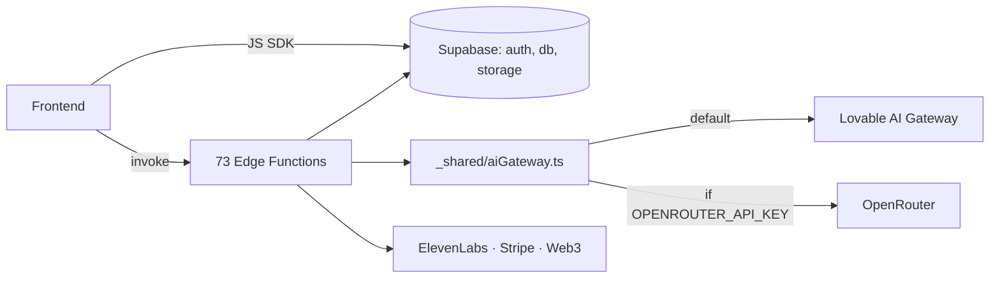

# P2 — Canonical Architecture + Runtime Map

## 1. Active Architecture (today)

```text
main.tsx
  └─ App.tsx
      ├─ QueryClientProvider
      ├─ ThemeProvider · LanguageProvider · AuthProvider
      ├─ EnvironmentProvider · MotionLayer
      ├─ AIONStateProvider · AionDecisionProvider
      ├─ AuroraChatProvider · GameStateProvider · SoulAvatarProvider
      ├─ Modal providers (Auth/Profile/Subscriptions/Wallet/Coaches)
      ├─ StoryWorldProvider · OverlayProvider · SmartOnboardingProvider
      └─ BrowserRouter
           ├─ Public routes (Index, Founding, Blog, Docs, Coaches…)
           ├─ ProtectedRoute → ProtectedAppShellV2 (ShellV2 runtime)
           │     ├─ ShellV2Header
           │     ├─ NavLayer (constellation anchors + RealmIntentBus)
           │     ├─ AionComposerDock
           │     ├─ RealmTransitionLayer (mood/atmosphere)
           │     ├─ SharedOrbStage (single WebGL canvas, OrbView)
           │     └─ <Outlet/>  (worlds, brain, arena, journey, etc.)
           └─ Cross-cutting hosts:
                InteractiveAIONHost · CloudAuthModal · DiagnosticsHost
                PersistentWorldOrb · WorldsRuntime · DreamRuntime
                AtmosphereLayer · ConsciousnessField · MatrixRain
```

Provider tree depth: **22 nested providers** at root.
Root-mounted runtimes (always-on): WorldsRuntime, DreamRuntime, AtmosphereLayer, SharedOrbStage, InteractiveAIONHost, PersistentWorldOrb.

## 2. Target Architecture (post-export)

```text
main.tsx
  └─ App.tsx
      ├─ CoreProviders (Query/Theme/Lang/Auth)         ← always
      ├─ AIONRuntime  (state + decision + orb + chat)  ← always
      ├─ ModalRouterProvider (collapses 5 modal ctxs)  ← always
      ├─ Router
      │    ├─ Public routes (lazy)
      │    └─ ShellV2 (protected)
      │         ├─ NavLayer + ComposerDock + TransitionLayer
      │         ├─ SharedOrbStage   (the only <Canvas>)
      │         └─ <Outlet/>
      └─ DeferredRuntimes (mount inside Shell only):
           WorldsRuntime · DreamRuntime · AtmosphereLayer
```

Goals: 1 canvas, 1 AION runtime, 1 modal router, runtimes mounted only inside Shell, public routes free of heavy contexts.

## 3. Mermaid — Runtime Ownership

```mermaid
graph TD
  M[main.tsx] --> A[App.tsx]
  A --> P[Provider Stack x22]
  P --> R[BrowserRouter]
  R --> PUB[Public Pages]
  R --> SH[ProtectedAppShellV2]
  SH --> NAV[NavLayer · RealmIntentBus]
  SH --> COMP[AionComposerDock]
  SH --> TRX[RealmTransitionLayer]
  SH --> ORB[SharedOrbStage / OrbView]
  SH --> OUT[Outlet pages]
  A --> WR[WorldsRuntime]
  A --> DR[DreamRuntime]
  A --> ATM[AtmosphereLayer]
  A --> AION[InteractiveAIONHost]
  AION -.uses.-> ORB
  WR -.feeds.-> ATM
  OUT --> WORLD[/worlds/:id]
  WORLD --> WR
```

## 4. Mermaid — Supabase / Edge Surface



## 5. Ownership Matrix

| Concern | Canonical owner | Notes |
|---|---|---|
| App shell | `src/shellv2/ProtectedAppShellV2.tsx` | ShellV2 is the only shell |
| Routes | `src/App.tsx` (69 routes) | Centralized |
| Artifacts | `src/components/artifacts/` + `src/lib/aion/artifact*` | Other generations legacy |
| Orb / atmosphere | `src/components/orb/v2/OrbView.tsx` + `SharedOrbStage` + `src/worlds/atmosphere/` | Single canvas |
| AION runtime | `src/contexts/AIONStateContext`, `AionDecisionContext`, `src/aion/presence/*` | DNA = SSOT |
| Mind Engine | `src/aion/`, `src/orchestration/`, `src/worlds/runtime/` | Hidden behind Shell |
| Backend | `supabase/functions/*` + `_shared/aiGateway.ts` | Migration seam |

## 6. Status Buckets

**Canonical (keep, do not refactor pre-export)**
- ShellV2, OrbView/SharedOrbStage, AION contexts, aiGateway, supabase/client.ts, App.tsx routing, worlds runtime.

**Legacy (still imported, plan to retire)**
- `src/hallway/*` (HallwayShell, RoomEnvironment, surfaces)
- Older orb generations under `src/components/orb/` (non-v2)
- `src/components/avatar/Avatar*` extra `<Canvas>` mounts (5 of 6 active)
- Modal contexts that ModalRouter will collapse

**Archive (no inbound imports)**
- `src/_legacy/*` (309 orphans baseline; see `scripts/orphans.snapshot.txt`)
- Older strategy/pillar specs

**Never touch pre-export**
- `src/integrations/supabase/{client.ts,types.ts}`
- `supabase/migrations/*`
- `supabase/functions/_shared/aiGateway.ts`
- `supabase/functions/_shared/cors.ts`
- `vite.config.ts`, `vercel.json`
- `src/main.tsx` bootstrap path
